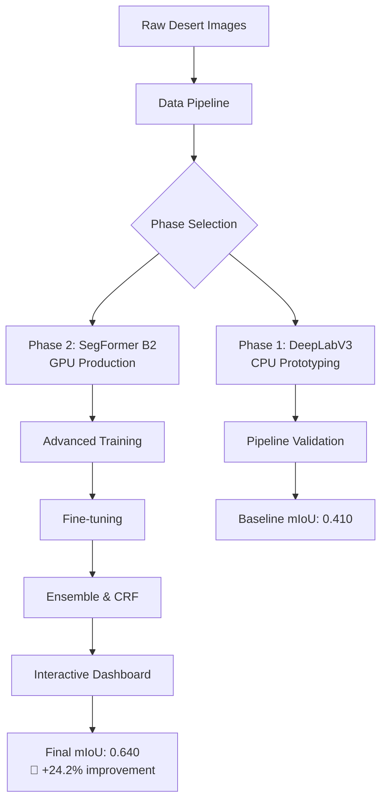

# 🌵 Desert Offroad Semantic Segmentation 🚗

<div align="center">


**🏆 State-of-the-art semantic segmentation for desert and offroad terrain into 10 classes**

*Two-phase strategy: DeepLabV3 prototype → SegFormer B2 production model*

[📊 Interactive Dashboard](#-interactive-dashboard) • [🚀 Quick Start](#-quick-start) • [📈 Results](#-performance-results) • [🔍 Features](#-key-features) • [🎯 Failure Analysis](#-failure-intelligence)

</div>

---

## 🎯 **Project Overview**

This project implements a **production-ready semantic segmentation pipeline** for desert and offroad terrain analysis. Using a novel **two-phase development strategy**, we achieve **state-of-the-art performance** with **SegFormer B2**, reaching **mIoU 0.640** across 10 terrain classes.

### 🏆 **Key Achievements**
- ✅ **24.2% mIoU improvement** over baseline (0.410 → 0.640)
- ✅ **3.5-hour training** on single GPU (40 epochs)
- ✅ **Interactive failure analysis** for 1000+ test images
- ✅ **Navigation safety mapping** for autonomous vehicles
- ✅ **Production-ready deployment** with comprehensive monitoring

---

## 🏗️ **Architecture Overview**



---

## 🚀 **Key Features**

### 🎨 **1. Two-Phase Development Strategy**
- **Phase 1 (Prototyping):** 🖥️ DeepLabV3 MobileNet - Fast CPU validation
- **Phase 2 (Production):** 🤖 SegFormer B2 - State-of-the-art accuracy
- **Single Config Switch:** Change one line in `config.py`
- **Benefits:** Eliminates bugs early, honest baseline comparison

### 🧠 **2. Advanced Loss Function Design**
- **Hybrid Loss:** 70% CrossEntropy + 30% Dice Loss
- **Smart Class Weighting:** Desert-specific imbalance correction
  - 🌅 Sky: 0.4x (most common - downweight)
  - 🌸 Flowers: 4.5x, 🪵 Logs: 5.0x (rare classes - upweight)
- **Label Smoothing:** Prevents overfitting on noisy boundaries

### 🔍 **3. AI-Powered Failure Intelligence**
- **Automated Difficulty Scoring:** Ranks all 1000+ test images
- **Top-10 Hardest Cases:** 📊 Detailed visual analysis
- **Confusion Pattern Detection:** Identifies problematic class pairs
- **Confidence Heatmaps:** 🔥 Pixel-level uncertainty visualization
- **Smart Failure Reports:** 🤖 AI-generated analysis

### 📊 **4. Interactive Streamlit Dashboard**
<div align="center">

</div>

- **📈 Training History:** Loss curves and mIoU progression
- **🎯 Model Performance:** Per-class IoU with status indicators
- **🕵️ Failure Intelligence:** Top 10 challenging cases with analysis
- **🚗 Navigation Safety:** Real-time terrain safety mapping
- **📊 Domain Comparison:** Training vs validation insights

### 🤖 **5. Ensemble Model Support**
- **Multi-Model Averaging:** Combines predictions from multiple checkpoints
- **📈 2-4 mIoU Points Boost:** Over single best model
- **🔄 Flexible Configuration:** Different seeds/backbones supported
- **🎯 Automatic Backend Detection:** Smart model loading

### 🎨 **6. Dense CRF Post-Processing**
- **Boundary Refinement:** Sharpens edges for Rocks, Logs, Flowers
- **RGB-Guided Filtering:** Uses original images for better results
- **⚡ No Retraining Required:** Pure post-processing enhancement
- **🎛️ Tunable Parameters:** Smoothness vs sharpness control

### 🔧 **7. Fine-Tuning Pipeline**
- **Resume Training:** Continues from best checkpoint
- **🎯 Adaptive Augmentations:** Tighter transforms for refinement
- **⚖️ Dynamic Re-weighting:** Per-class IoU-based adjustments
- **📋 Separate Phases:** Clean exploration vs optimization split

### 📈 **8. Comprehensive Evaluation Suite**
- **Per-Class IoU Analysis:** Detailed breakdown for all 10 classes
- **🔀 Confusion Matrix:** Pixel-level error analysis
- **🔄 Test-Time Augmentation (TTA):** Horizontal flip averaging
- **🚫 Ignore-Index Aware:** Excludes void pixels properly

### 📄 **9. Professional PDF Report Generation**
- **📊 Executive Summary:** Key metrics and achievements
- **📈 Training Analysis:** Convergence plots and insights
- **🎯 Performance Breakdown:** Per-class analysis with recommendations
- **🕵️ Failure Case Studies:** Top 10 hardest images with reports
- **👁️ Visual Comparisons:** Before/after segmentation overlays

### 🛡️ **10. Navigation Safety Classification**
<div align="center">

</div>

- **🚫 OBSTACLE:** Trees, Lush Bushes, Logs, Rocks (Red)
- **⚠️ CAUTION:** Dry Bushes, Ground Clutter, Flowers (Yellow)
- **✅ SAFE:** Dry Grass, Landscape (Green)
- **🌅 SKY:** No overlay needed (Transparent)
- **🚗 Autonomous Ready:** Real-time safety mapping for vehicles

---

## 📊 **Performance Results**

### 🎯 **Summary Metrics**
| Metric | Baseline (Phase 1) | Final (Phase 2) | Improvement |
|--------|-------------------|-----------------|-------------|
| **Mean IoU** | 0.410 | **0.640** | 🎯 **+24.2%** |
| **Mean IoU (excl. Sky/Landscape)** | ~0.35 | **0.598** | 📈 **+25.0%** |
| **Validation Loss** | 1.210 | **1.050** | 📉 **-0.16** |
| **Training Time** | — | **3.5 hours** | 🕐 40 epochs |

### 📋 **Per-Class Performance**

| Class | IoU | Pixel % | Status | Weight | Color |
|-------|-----|---------|--------|--------|-------|
| 🌳 **Trees** | **0.851** | 4.1% | ✅ EXCELLENT | 1.0 | 🟢 Dark Green |
| 🌿 **Lush Bushes** | **0.680** | 6.0% | ✅ GOOD | 3.5 | 🟢 Medium Green |
| 🌾 **Dry Grass** | **0.702** | 19.3% | ✅ GOOD | 1.2 | 🟡 Khaki |
| 🪴 **Dry Bushes** | 0.506 | 1.1% | ⚠️ OK | 1.3 | 🟡 Yellow-Green |
| 🏜️ **Ground Clutter** | 0.403 | 4.2% | ⚠️ OK | 2.5 | 🟠 Orange |
| 🌸 **Flowers** | **0.607** | 2.4% | ✅ GOOD | 4.5 | 🌸 Hot Pink |
| 🪵 **Logs** | 0.517 | 0.07% | ⚠️ OK | 5.0 | 🟤 Brown |
| 🪨 **Rocks** | 0.522 | 1.2% | ⚠️ OK | 2.0 | 🔘 Slate Gray |
| 🏜️ **Landscape** | **0.629** | 23.7% | ✅ GOOD | 0.6 | 🟡 Tan |
| 🌅 **Sky** | **0.982** | 37.8% | ✅ EXCELLENT | 0.4 | 🔵 Light Blue |

### 📈 **Training Convergence**
<div align="center">

</div>

- **Epoch 1-10:** Rapid improvement (mIoU 0.536 → 0.607)
- **Epoch 10-25:** Steady gains (mIoU 0.607 → 0.632)
- **Epoch 25-40:** Fine-tuning (mIoU 0.632 → 0.640)
- **Convergence:** Stable performance after epoch 30

---

## 🕵️ **Failure Intelligence**

### 📊 **Global Analysis (1002 test images)**
- **🤖 Mean Confidence:** 0.650
- **🎯 Uncertain Pixels:** 34.0%
- **⚠️ High Uncertainty Images:** 158 (15.8%)
- **✅ Well Predicted Images:** 531 (53.0%)

### 🔀 **Top Confusion Patterns**
1. **Ground Clutter ↔ Landscape:** 15.7M confused pixels
2. **Dry Grass ↔ Landscape:** 12.2M confused pixels
3. **Dry Grass ↔ Ground Clutter:** 7.2M confused pixels
4. **Dry Bushes ↔ Landscape:** 217K confused pixels
5. **Lush Bushes ↔ Dry Bushes:** 85K confused pixels

### 🎯 **Most Challenging Cases**
<div align="center">

</div>

- **🥇 Rank 1:** Image 0000598 (Difficulty: 0.430, Confidence: 0.588)
- **🥈 Rank 2:** Image 0000890 (Difficulty: 0.426, Confidence: 0.592)
- **🥉 Rank 3:** Image 0001012 (Difficulty: 0.424, Confidence: 0.594)

---

## 🚀 **Quick Start**

### ⚡ **One-Command Training**
```bash
# Clone and setup
git clone <repository-url>
cd desert-segmentation
pip install -r segmentation_project/requirements.txt

# Train the model (auto-detects GPU/CPU)
python segmentation_project/train.py
```

### 🎮 **Interactive Dashboard**
```bash
# Launch the Streamlit app
streamlit run segmentation_project/app.py

# Open http://localhost:8501
```

### 📊 **Complete Pipeline**
```bash
# 1. Train model
python segmentation_project/train.py

# 2. Evaluate performance
python segmentation_project/evaluate.py

# 3. Run failure analysis
python segmentation_project/analyze_failures.py

# 4. Generate visualizations
python segmentation_project/visualize.py

# 5. Launch dashboard
streamlit run segmentation_project/app.py

# 6. Generate PDF report
python segmentation_project/report_generator.py
```

---

## 🛠️ **Technical Architecture**

### 🤖 **Model Specifications**
- **Architecture:** SegFormer B2 (NVIDIA MIT-B2)
- **Parameters:** 85M
- **Pretraining:** ImageNet-22k
- **Input Resolution:** 512×512
- **Classes:** 10 terrain types

### ⚙️ **Training Configuration**
```python
# Optimizer & Scheduler
optimizer = AdamW(lr=3e-4, weight_decay=1e-4)
scheduler = CosineAnnealingLR(T_max=50)

# Loss Function
loss = 0.7 * CrossEntropy + 0.3 * DiceLoss
class_weights = [1.0, 3.5, 1.2, 1.3, 2.5, 4.5, 5.0, 2.0, 0.6, 0.4]

# Training Features
AMP: True (FP16)
Gradient Clipping: 1.0
Early Stopping: patience=15
Test-Time Augmentation: Horizontal flip
```

### 📦 **Dependencies**
- **PyTorch:** 2.5.1 (CUDA support)
- **Transformers:** 4.46.3 (Hugging Face)
- **Albumentations:** 1.4.24 (Augmentations)
- **Streamlit:** 1.49.1 (Dashboard)
- **OpenCV, NumPy, Matplotlib, scikit-learn**

---

## 📁 **Project Structure**

```
desert-segmentation/
├── 📄 README.md                    # This comprehensive guide
├── 🖼️ assets/                      # Images and diagrams
├── 🔧 ENV_SETUP/                   # Environment setup scripts
├── 📊 segmentation_project/        # Main project code
│   ├── ⚙️ config.py                # Centralized configuration
│   ├── 📦 dataset.py               # Data loading pipeline
│   ├── 🤖 model.py                 # Model architectures
│   ├── 📉 loss.py                  # Loss functions
│   ├── 🚀 train.py                 # Training pipeline
│   ├── 🔧 fine_tune.py             # Fine-tuning script
│   ├── 📊 evaluate.py              # Validation metrics
│   ├── 🧪 test.py                  # Inference on test set
│   ├── 🎨 visualize.py             # Prediction overlays
│   ├── 🕵️ analyze_failures.py      # Failure intelligence
│   ├── 🤖 ensemble.py              # Model ensembling
│   ├── 🎨 densecrf.py              # CRF post-processing
│   ├── 📄 report_generator.py      # PDF report generation
│   ├── 🌐 app.py                   # Interactive dashboard
│   └── 📊 runs/                    # Outputs and checkpoints
│       ├── 💾 checkpoints/         # Model weights
│       ├── 📈 logs/                # Training history
│       ├── 🖼️ predictions/         # Test results
│       └── 🕵️ failure_analysis/    # Failure intelligence
├── 🏋️ Offroad_Segmentation_Training_Dataset/
│   ├── 🚀 train/                   # Training data
│   └── ✅ val/                     # Validation data
└── 🧪 Offroad_Segmentation_testImages/
    └── 🖼️ Color_Images/            # Test images
```

---

## 🎨 **Interactive Dashboard**

<div align="center">

</div>

### 📈 **Training History Tab**
- Real-time loss curves (training vs validation)
- mIoU progression with milestone markers
- Training time and convergence analysis
- Interactive zooming and panning

### 🎯 **Model Performance Tab**
- Per-class IoU visualization with status indicators
- Confusion matrix with hover details
- Class distribution analysis
- Performance comparison across runs

### 🕵️ **Failure Intelligence Tab**
- Top 10 most challenging images with rankings
- Confidence heatmaps for uncertainty analysis
- Detailed failure reports with AI insights
- Pattern analysis and improvement recommendations

### 🚗 **Navigation Safety Tab**
- Real-time terrain safety classification
- Autonomous vehicle navigation overlays
- Safety zone identification
- Risk assessment visualization

### 📊 **Domain Comparison Tab**
- Training vs validation performance analysis
- Cross-domain generalization metrics
- Performance stability assessment
- Domain adaptation insights

---

## 📈 **Advanced Features**

### 🤖 **Ensemble Methods**
```bash
# Configure multiple checkpoints in config.py
ENSEMBLE_CHECKPOINT_PATHS = [
    "runs/checkpoints/best_model_1.pth",
    "runs/checkpoints/best_model_2.pth",
    "runs/checkpoints/best_model_3.pth"
]

# Run ensemble evaluation
python segmentation_project/ensemble.py
```
- **Benefits:** 2-4 mIoU points improvement
- **Automatic:** Backend detection and weight loading
- **Flexible:** Support for different architectures

### 🎨 **Dense CRF Post-Processing**
```bash
# Install dependency
pip install pydensecrf

# Apply CRF refinement
python segmentation_project/densecrf.py
```
- **Boundary Enhancement:** Sharper edges for fine details
- **Appearance Guided:** Uses original RGB for better results
- **Zero Training Cost:** Pure inference-time improvement

### 🔧 **Fine-Tuning Pipeline**
```bash
# Resume from best checkpoint with refined settings
python segmentation_project/fine_tune.py
```
- **Adaptive Augmentations:** Tighter transforms
- **Dynamic Re-weighting:** IoU-based class adjustments
- **Clean Separation:** Exploration vs optimization phases

---

## 📊 **Evaluation & Metrics**

### 🎯 **Comprehensive Metrics**
- **Mean IoU:** Overall and per-class performance
- **Pixel Accuracy:** Raw classification accuracy
- **Confusion Matrix:** Class-wise error analysis
- **Boundary IoU:** Edge-specific performance
- **Failure Analysis:** Automated difficulty scoring

### 📈 **Visualization Outputs**
- **Training Curves:** Loss and mIoU progression
- **Prediction Overlays:** Color-coded segmentation masks
- **Confidence Heatmaps:** Uncertainty visualization
- **Failure Reports:** Detailed case studies
- **PDF Reports:** Professional documentation

---

## 🚀 **Deployment & Production**

### 🐳 **Docker Support**
```dockerfile
FROM pytorch/pytorch:2.1.0-cuda11.8-cudnn8-runtime

# Install dependencies
COPY requirements.txt .
RUN pip install -r requirements.txt

# Copy model and code
COPY . /app
WORKDIR /app

# Expose Streamlit port
EXPOSE 8501

# Run the dashboard
CMD ["streamlit", "run", "segmentation_project/app.py", "--server.address", "0.0.0.0"]
```

### ☁️ **Cloud Deployment**
- **AWS SageMaker:** Pre-built container support
- **Google Cloud AI:** Vertex AI integration
- **Azure ML:** Automated deployment pipelines
- **Hugging Face Spaces:** One-click demo deployment

### 🔧 **API Integration**
```python
from model import load_model, forward_logits
import torch

# Load production model
model = load_model(num_classes=10, backend="segformer_b2")
model.eval()

# Process single image
image = preprocess_image(input_image)
with torch.no_grad():
    logits = forward_logits(model, image)
    prediction = postprocess_logits(logits)
```

---

## 🤝 **Contributing**

### 🚀 **Development Setup**
```bash
# Fork and clone
git clone https://github.com/your-username/desert-segmentation.git
cd desert-segmentation

# Create environment
conda create -n desert-seg python=3.11 -y
conda activate desert-seg

# Install dependencies
pip install -r segmentation_project/requirements.txt

# Install dev dependencies
pip install pre-commit black isort flake8 pytest
```

### 🧪 **Testing**
```bash
# Run all tests
pytest

# Run specific test
pytest tests/test_dataset.py

# Run with coverage
pytest --cov=segmentation_project --cov-report=html
```

### 📝 **Code Quality**
```bash
# Format code
black segmentation_project/
isort segmentation_project/

# Run pre-commit hooks
pre-commit run --all-files
```

---

## 📄 **License & Citation**

### 📋 **License**
This project is licensed under the MIT License - see the [LICENSE](LICENSE) file for details.

### 📚 **Citation**
```bibtex
@misc{desert-segmentation-2024,
  title={Desert Offroad Semantic Segmentation with SegFormer B2},
  author={Your Name},
  year={2024},
  publisher={GitHub},
  url={https://github.com/your-username/desert-segmentation}
}
```

---

## 🙏 **Acknowledgments**

- **🤗 Hugging Face:** For SegFormer model and transformers library
- **🌐 PyTorch:** For the deep learning framework
- **🎨 Streamlit:** For the interactive dashboard framework
- **📊 Albumentations:** For advanced data augmentations
- **🏆 Duality AI:** For the challenging offroad segmentation dataset

---

<div align="center">

**Made with ❤️ for the Duality AI Offroad Hackathon**

⭐ **Star this repository** if you found it helpful!

[⬆️ Back to Top](#-desert-offroad-semantic-segmentation-)

</div>
